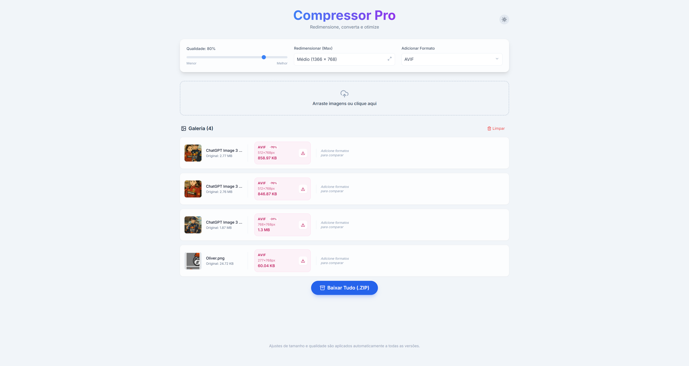

# Compressor Pro



**Compressor Pro** é uma ferramenta web moderna e eficiente para otimização, conversão e redimensionamento de imagens. Construída com foco em privacidade e performance, toda a execução acontece diretamente no seu navegador, sem enviar seus arquivos para servidores externos.

## 🚀 Funcionalidades

- **Processamento Local (Client-side)**: Suas imagens nunca saem do seu computador. Segurança e privacidade total.
- **Múltiplos Formatos**: Converta suas imagens para **WebP**, **AVIF**, **JPEG** ou **PNG**.
- **Redimensionamento Inteligente**: Predefinições prontas para uso:
  - 📱 Redes Sociais (LinkedIn/Instagram)
  - 📏 Tamanhos Padrão (HD, Full HD)
  - 🔧 Personalizado (Manter original)
- **Controle de Qualidade**: Ajuste fino da compressão para encontrar o equilíbrio perfeito entre tamanho e qualidade visual.
- **Interface Moderna**: Design responsivo com suporte nativo a **Modo Escuro (Dark Mode)** e **Modo Claro**.
- **Processamento em Lote**: Arraste e solte múltiplas imagens e baixe todas de uma vez em formato **ZIP**.
- **Feedback Visual**: Compare o tamanho original com o tamanho otimizado e veja a economia em tempo real.

## 🛠️ Tecnologias Utilizadas

O projeto foi construído utilizando tecnologias modernas sem a necessidade de _bundlers_ complexos para facilitar o uso e estudo:

- **HTML5 & CSS3**
- **React 18** (via CDN)
- **Tailwind CSS** (via CDN para estilização rápida)
- **Babel** (para compilação JSX em tempo real)
- **JSZip** (para gerar arquivos compactados)
- **Lucide React** (para ícones vetoriais)

## 📦 Como Usar

1. **Abra a aplicação**: Carregue a página no seu navegador.
2. **Configure**: Escolha a qualidade desejada e o formato de saída (ex: WebP para web).
3. **Upload**: Arraste suas imagens para a área pontilhada ou clique para selecionar.
4. **Aguarde**: O sistema processará as imagens automaticamente.
5. **Baixe**: Salve as imagens individualmente ou clique em "Baixar Tudo (.ZIP)".

## 🏃 Como Rodar o Projeto

Este é um projeto estático que roda diretamente no navegador.

### Opção 1: Simples (Apenas abrir)

Basta dar um duplo clique no arquivo `index.html`.

_Nota: Alguns recursos avançados de navegador podem exigir um servidor local devido a políticas de segurança (CORS), mas a funcionalidade básica deve operar normalmente._

### Opção 2: Servidor Local (Recomendado)

Para a melhor experiência, rode com um servidor local simples.

Se você tem o **Visual Studio Code**:

1. Instale a extensão "Live Server".
2. Clique com o botão direito no `index.html` e escolha "Open with Live Server".

Se você tem **Node.js** instalado:

```bash
npx serve .
```

Se você tem **Python** instalado:

```bash
# Python 3
python -m http.server
```

---

Desenvolvido com ❤️ para otimizar sua web.
